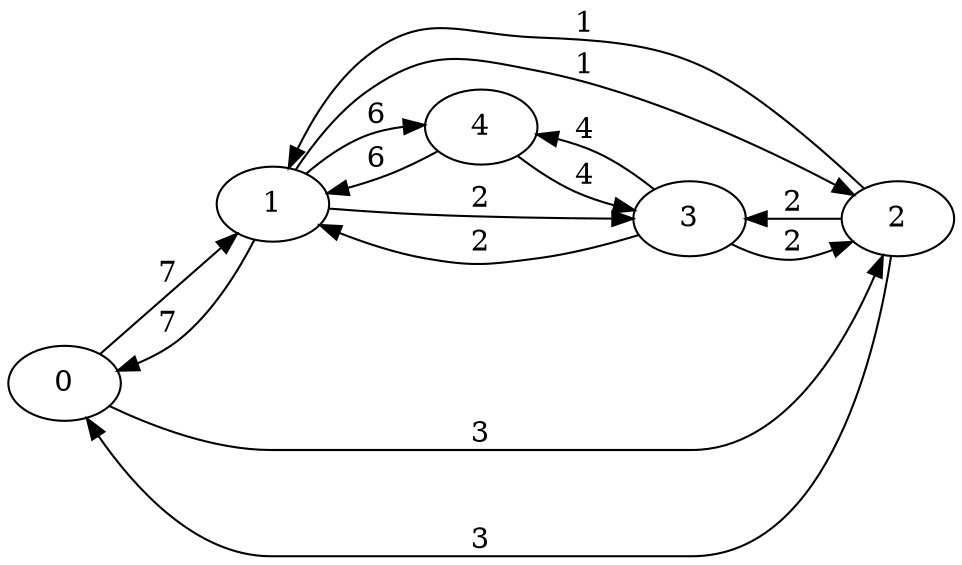

# Exercise 6: Shortest Path using power operation

The power operation is using tropical semiring operation: min of sums

## Rust implementation

semigroup.rs has the generic implementation of power multiplication

### Run tests, with a simple graph



cargo test


## Q implementation

Solve shortest_path on a simple graph:

```
q shortest_path.q
```

# Exercise 6: Part 2
Polynomial evaluator using Horner's rule

```
q poly.q
```


